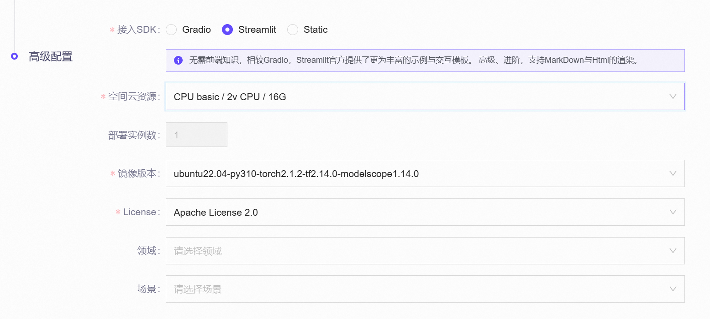
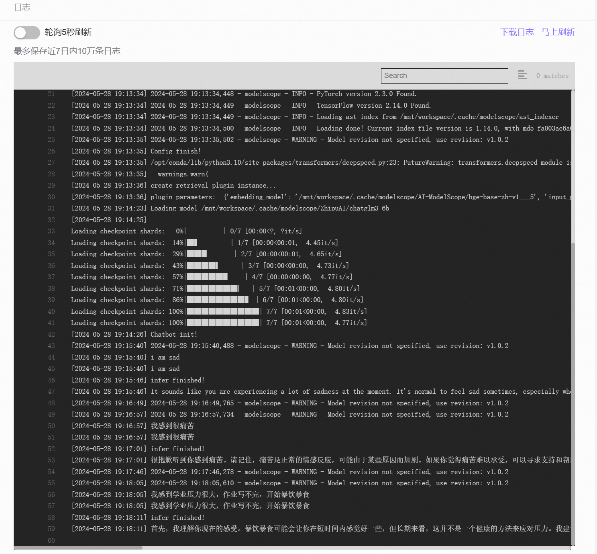
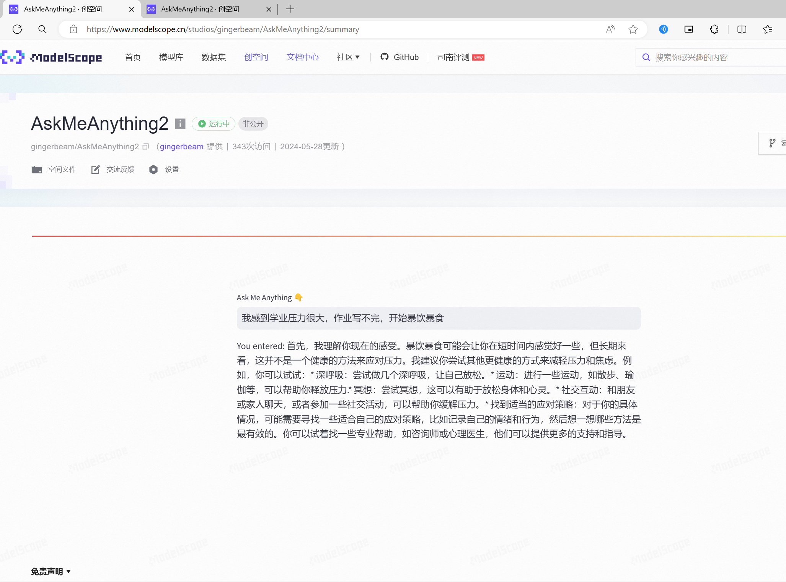

# AskMeAnything2 心理健康Chatbot
Powered by [Intel® Extension for Transformers](https://github.com/intel/intel-extension-for-transformers)

ModelScope链接：https://www.modelscope.cn/studios/gingerbeam/AskMeAnything2/summary

## 模型
- 预训练大模型：ZhipuAI/chatglm3-6b
- embedding模型：AI-ModelScope/bge-base-zh-v1.5
使用了ModelScope提供的模型下载服务：
```python
#模型下载
from modelscope import snapshot_download
embedding_model_dir = snapshot_download('AI-ModelScope/bge-base-zh-v1.5')
llm_dir = snapshot_download('ZhipuAI/chatglm3-6b')
```

## 数据集
心理健康对话数据集，下载自：https://huggingface.co/datasets/Amod/mental_health_counseling_conversations

## 文件结构
```
|
|-app.py # 主文件，包含NeuralChat提供的python接口和streamlit界面
|-mental_health.txt # 数据集
|-requirements.txt # 安装依赖
```

## 在ModelScope的部署
本项目在[ModelScope](https://www.modelscope.cn/)创空间上进行了部署，部署过程非常简单，把项目上传至ModelScope的git仓库，Streamlit SDK默认的程序入口为`app.py`. 选择合适的云服务环境（你可以选择免费的双核16G，但是内存有点小，可以选3毛钱一个小时的8核32G环境）：

然后点击上线创空间，等待发布就可以了！

## [Intel® Extension for Transformers](https://github.com/intel/intel-extension-for-transformers)
借助[Intel® Extension for Transformers](https://github.com/intel/intel-extension-for-transformers)的NeuralChat框架，在Intel CPU上实现了基于开源大模型的聊天机器人部署、RAG以及模型量化压缩.

技术细节：
主要是NeuralChat框架一键搭建chatbot的功能，NeuralChat还提供了很多plugins可供使用，可以实现RAG检索、语言识别、安全词检查等功能；RtnConfig则是NeuralChat的提供一个大模型优化压缩功能，可以做INT8 Weight-only Quantization：
```python
from intel_extension_for_transformers.neural_chat import PipelineConfig
from intel_extension_for_transformers.neural_chat import build_chatbot
from intel_extension_for_transformers.neural_chat import plugins
from intel_extension_for_transformers.transformers import RtnConfig
```
初始化推理pipeline配置以及生成chatbot，配置RAG检索插件，然后返回NeuralChat的chatbot接口，就可以一键生成RAG聊天机器人：
```python
def init():
    plugins.retrieval.enable=True
    plugins.retrieval.args['embedding_model'] = embedding_model_dir
    plugins.retrieval.args["input_path"]="./mental_health.txt"

    config = PipelineConfig(model_name_or_path=llm_dir, plugins=plugins)
    print("Config finish!")
    
    chatbot = build_chatbot(config)
    print("Chatbot init!")
    return chatbot
```
用streamlit与用户交互，获取用户问的问题，然后通过LLM+RAG生成对咨询者的回复：
```python
cb = init()

def response(question):
    print(question)
    answer = cb.predict(query=question)
    print('infer finished!')
    return answer

if "visibility" not in st.session_state:
    st.session_state.visibility = "visible"
    st.session_state.disabled = False

text_input = st.text_input(
    "Ask Me Anything 👇",
    label_visibility=st.session_state.visibility,
    disabled=st.session_state.disabled,
)

if text_input:
    print(text_input)
    answer = response(text_input)
    print(answer)
    st.write("You entered: ", answer)
```
配置模型优化压缩，只要加入推理pipeline：
```python
from intel_extension_for_transformers.transformers import RtnConfig
optimization_config=RtnConfig(compute_dtype="int8",
weight_dtype="int4_fullrange"))
config = PipelineConfig(model_name_or_path='ZhipuAI/chatglm3-6b', plugins=plugins)
```

## 效果展示


在`chatbot_rag.ipynb`中可以看到在notebook中更详细直观的效果.

## 从ModelScope上面Clone本项目
```bash
 git clone https://www.modelscope.cn/studios/gingerbeam/AskMeAnything2.git
```
如果你有装有较新Intel芯片的物理机器，也可以考虑本地部署，具体可以参考：
- [Intel® Extension for Transformers的github仓库查看是否有合适的平台](https://github.com/intel/intel-extension-for-transformers)
- [ModelScope的文档中心，研究一下ModelScope的库](https://www.modelscope.cn/docs)

## 有酷睿就可以快乐做推理+RAG/TTS了
